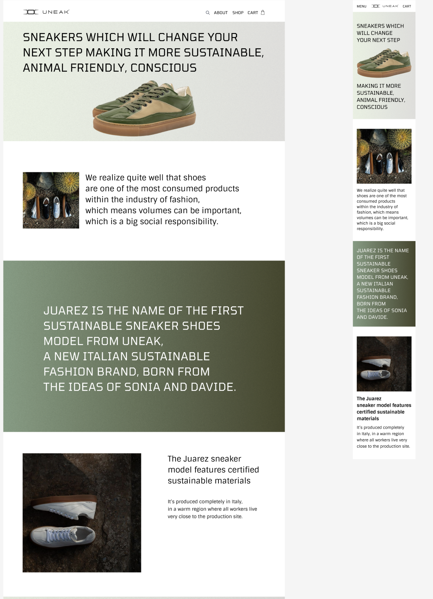

# HTML & CSS

## Домашне завдання №7

### Макет [тут](https://www.figma.com/file/C8BjRoCL25QL1stXbxjgOA/Front-end-Beginning-1.3---2.1?type=design&node-id=297-93&mode=design&t=ArqwrUgvE9c5DuOE-0:

Тепер завдання імплементувати його заново, але враховуючи, що це повинен бути респонсів дизайн, тобто сторінка повинна нормально відображатись на будь-якій ширині екрану (\*починаючи з 320пх). В макеті задано стан для мобільного телефону, та для десктопу, всі проміжні стани можна робити за своїми вподобаннями. Можна використовувати напрацювання з попередніх домашніх робіт. Блок the process не потрібно робити.

- Врахувати структуру HTML.
- Додати всі необхідні метатеги.
- Розмітка має бути у файлі `index.html`
- Стилі мають буті у файли `style.css`
- Зображення потрібно складати у папочку images
- Результат повирнен максимально відповідати макету
- Сторінка повинна відображатись на телефонах так як зображено на макеті моб версії
- Сторінка повинна відображатись на декстопі так як зображено на макеті десктоп версії
- Всі інші стани можуть варіюватись на вибір розробника

# Як робити зав'дання

- Зробіть окрему гілку для домашнього завдання: `git checkout -b homework`
- Вирішіть зав'дання та створіть коміт: `git commit -a -m "homework"`
- Відправте коміт до GitHub: `git push --set-upstream origin homework`
- Зробіть пул-реквест: `https://github.com/prjctr-html-css/[git-user-name]home-work-7/pull/new/homework`
