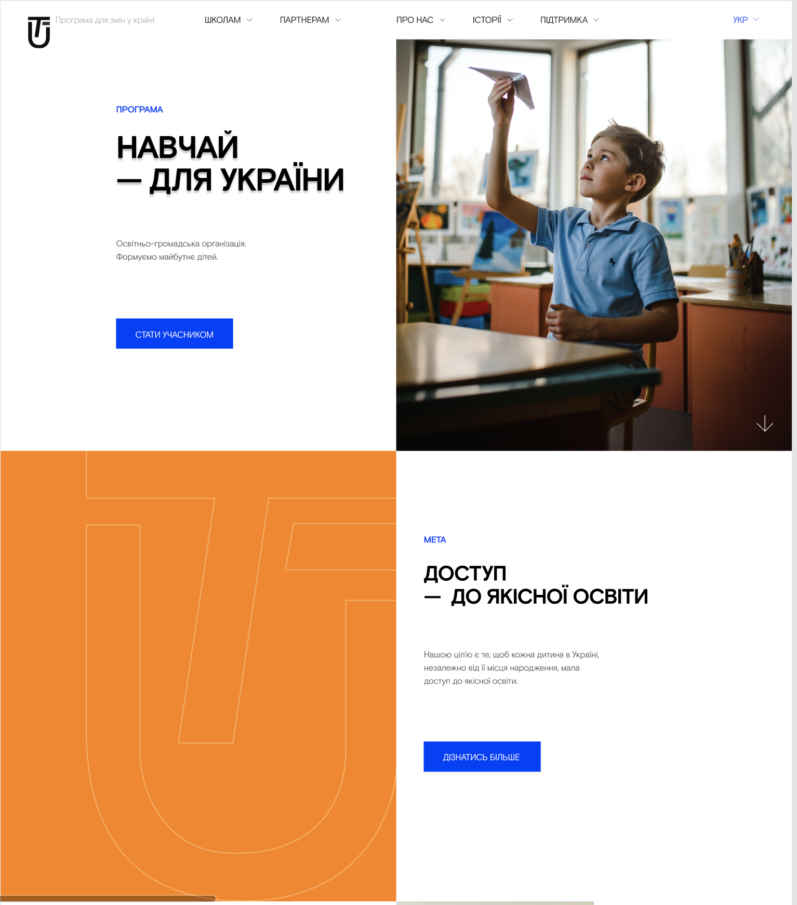

# HTML & CSS

## Домашне завдання №6

### Макет [тут](https://www.figma.com/file/x0kSvNBxFBqDmMhgZS54JJ/Teach-for-UA_Mikhaylova_Julia-(FE_beg)?type=design&node-id=1-2&mode=design):

Потрібно pробити розмітку частини сторінки.
Хедер, та блоки програма та мета

- Врахувати структуру HTML.
- Додати всі необхідні метатеги.
- Розмітка має бути у файлі `index.html`
- Стилі мають буті у файли `style.css`
- Зображення потрібно складати у папочку images
- Результат повирнен максимально відповідати макету
- Обовʼязково використати флекс чи грід для розміщення блоків
- Звернути увагу на повторення стилю елементів в різних блоках 
- Підключити шрифт з файлів, файли шрифтів знаходяться в архіві в './fonts/'

# Як робити зав'дання

- Зробіть окрему гілку для домашнього завдання: `git checkout -b homework`
- Вирішіть зав'дання та створіть коміт: `git commit -a -m "homework"`
- Відправте коміт до GitHub: `git push --set-upstream origin homework`
- Зробіть пул-реквест: `https://github.com/prjctr-html-css/[git-user-name]home-work-6/pull/new/homework`
